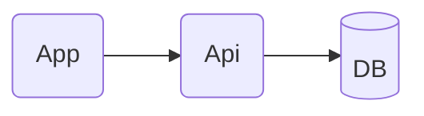

# 강연 예약 시스템 구축

## 개발스펙

| 개발언어 | Java 17 |
| --- | --- |
| 프레임워크 | Spring Boot 3.1.2 |
| RDBMS | MySQL 8.0.18 |

## 데이터 구조 설계

### 강연 예약 시스템 (lecture_reservation_system)

1. 강연장 (lecture_hall)
    
    
    | 필드명 | 설명 | 형식 | 특징 |
    | --- | --- | --- | --- |
    | lecture_hall_id | 강연장 ID | bigint | PK, auto_increment |
    | lecture_hall_name | 강연장 이름 | varchar(150) | not null |
    | employee_id | 담당 직원 ID | bigint |  |
    | create_time | 등록 시간 | timestamp | 기본 등록 |
    | update_time | 수정 시간 | timestamp | 기본 등록, 기본 수정 |
    | use_yn | 사용 여부 | tinyint(1) | not null, 기본 1 |
    
    | 인덱스명 | 설명 | 키 | 특징 |
    | --- | --- | --- | --- |
    | idx_lecture_hall_1 | 이름, 사용 여부 검색 | hall_name, use_yn |  |
2. 강연 (lecture)
    
    
    | 필드명 | 설명 | 형식 | 특징 |
    | --- | --- | --- | --- |
    | lecture_id | 강연 ID | bigint | PK, auto_increment |
    | lecture_hall_id | 강연장 ID | bigint | FK, not null |
    | lecturer_name | 강연자 이름 | varchar(150) | not null |
    | lecture_title | 강연 주제 | varchar(500) | not null |
    | lecture_contents | 강연 내용 | varchar(5000) | not null |
    | lecture_start_time | 강연 시작 시간 | timestamp | not null |
    | lecture_end_time | 강연 종료 시간 | timestamp | not null |
    | lecture_seats_max | 강연 최대 신청 인원 | int | not null |
    | employee_id | 담당 직원 ID | bigint |  |
    | create_time | 등록 시간 | timestamp | 기본 등록 |
    | update_time | 수정 시간 | timestamp | 기본 등록, 기본 수정 |
    | use_yn | 사용 여부 | tinyint(1) | not null, 기본 1 |
    
    | 인덱스명 | 설명 | 키 | 특징 |
    | --- | --- | --- | --- |
    | idx_lecture_1 | 강연장 ID | lecture_hall_id, use_yn |  |
3. 강연 신청 (lecture_registration)
    
    
    | 필드명 | 설명 | 형식 | 특징 |
    | --- | --- | --- | --- |
    | lecture_registration_id | 강연 신청 ID | bigint | PK, auto_increment |
    | lecture_id | 강연 ID | bigint | FK, not null |
    | employee_id | 신청 직원 ID | bigint | FK, not null |
    | create_time | 등록 시간 | timestamp | 기본 등록 |
    | update_time | 수정 시간 | timestamp | 기본 등록, 기본 수정 |
    | use_yn | 사용 여부 | tinyint(1) | not null, 기본 1 |
    
    | 인덱스명 | 설명 | 키 | 특징 |
    | --- | --- | --- | --- |
    | idx_lecture_registration_1 | 강연, 직원 | lecture_id, employee_id | unique |
    | idx_lecture_registration_2 | 강연 신청 수 확인 | lecture_id, use_yn |  |
    | idx_lecture_registration_3 | 직원 중복 확인 | lecture_id, employee_id, use_yn |  |
4. 직원 (employee)
    
    
    | 필드명 | 설명 | 형식 | 특징 |
    | --- | --- | --- | --- |
    | employee_id | 직원 ID | bigint | PK, auto_increment |
    | employee_number | 사번 | char(5) | not null |
    | password | 비밀번호 | varchar(256) | not null |
    | name | 이름 | varchar(150) | not null |
    | authority | 권한 | tinyint | not null |
    | manager_employee_id | 관리자 직원 ID | bigint |  |
    | create_time | 등록 시간 | timestamp | 기본 등록 |
    | update_time | 수정 시간 | timestamp | 기본 등록, 기본 수정 |
    | use_yn | 사용 여부 | tinyint(1) | not null, 기본 1 |
    
    | 인덱스명 | 설명 | 키 | 특징 |
    | --- | --- | --- | --- |
    | idx_employee_1 | 사번 | employee_number | unique |

## 서비스 구조 설계

### 1안) MSA 구성, MQ를 통한 실시간 수치 반영, 기간/리소스 추가 소요 발생

```mermaid
flowchart LR

1(App)
2((GW))
3(Api)
4(Api)
5[(DB)]
6[(DB)]
7[[MQ]]

1-->|Api|2
2-->|인증 URI|3
2-->|강연정보 URI|4
subgraph <b><직원>
	3-->5
end
subgraph <b><강연>
	4-->6
	4-->|신청자, 랭킹|7
end
7-->|신청자, 랭킹|1
4-->|인증확인|3
```

### 2안) 심플한 구성으로 신속, 안정적인 개발



## API 항목

### Backend

1. 강연 목록 (전체)
    1. POST / page, size, searchText, searchStartTime, searchEndTime / List
2. 강연 등록 (강연자, 강연장, 신청인원, 강연시간, 강연내용)
    1. POST / 등록정보 / 성공여부
3. 강연 신청자 목록 (강연별 신청한 사번 목록)
    1. GET / 강연ID / Map, List

### Frontend 예정

1. 강연 목록 (신청 가능한 싯점부터 강연시작시간 1일 후까지 노출)
    1. POST / page, size, searchText, searchStartTime, searchEndTime / List
2. 강연 신청 (사번 입력, 같은 강연 중복 신청 제한)
    1. POST / 사번, 강연ID / 성공여부
3. 신청내역 조회(사번 입력)
    1. POST / page, size, 사번 / List
4. 신청한 강연 취소
    1. DELETE / 사번, 강연ID / 성공여부
5. 실시간 인기 강연
    1. POST / page, size / List

## 개발 후기

- 예전 면접용 프로젝트 과제로 진행하였습니다.
- 데이터 구조 설계는 면접용 필수 기능의 구현에 필요한 내용 위주로 진행 하였습니다. 실제 업무용 개발이라면 강연장의 위치, 좌석 수 등 추가 요소가 있을만한 내용에 대해 기획자, 화면 개발자 등 담당자와 회의 후 보완 사항을 검토했을 것 입니다.
- 실시간, 동시성 이슈를 해소하기 위해 Message Queue를 사용하고 확장성이 있는 Micro Service Architecture 방식을 적용한 설계를 1안으로 구상하였고 일정 상 시간 소요가 적은 2안으로 개발 진행 하였습니다.
